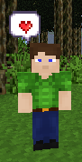
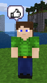
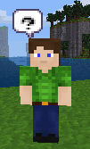

# Social Emotes for minetest

This mod adds chat commands that make bubbles with icons appear temporarily above the player.

"I did not want to hurt moma! I wanted to kiss her!" - My 5 yo, used to interactions with other players in cuter games.

There should be more than a wave/hit attitude for characters in Minetest. Here is a list of proposed emotes.


Commands available:
```
/love
/embarrassed
/exclamation
/question
/good
/bad
/idea
/sleepy
/sad
```

**License**: 
- Affero GPL 3.0 for the code
- Assuming CC-by-sa for the texture (need to confirm, see below)


The icons used come from [here](https://kicked-in-teeth.itch.io/emoticons). The author is [Kicked In Teeth](https://kicked-in-teeth.itch.io/) and stated: 

> free to edit
> 
> free for commercial use

Unfortunately no specific license has been explicitly provided.




